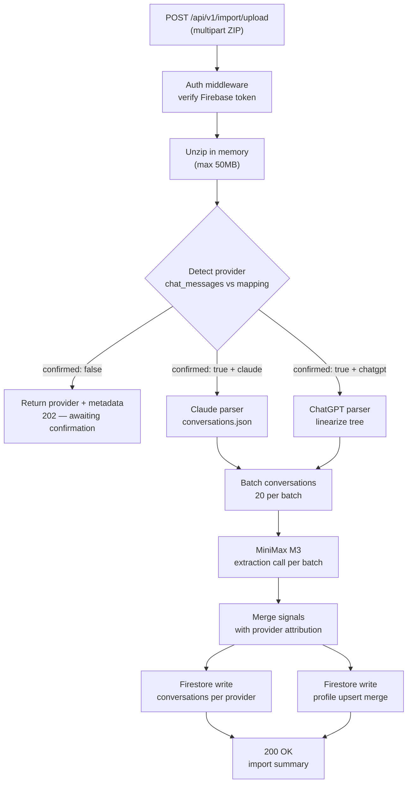

# feat: Importacion pipeline

## Summary

API Fastify/TypeScript que acepta un ZIP de exportacion de Claude o ChatGPT, detecta el proveedor automaticamente, parsea las conversaciones, las envia en batches a MiniMax M3 para extraer senales de contexto estructuradas, y persiste historial crudo + perfil sintetizado en Firestore. Firebase Auth (email/password + Google) maneja la identidad del usuario. Incluye controles de privacidad (delete granular por proveedor, revocacion de acceso por sitio como stub).

---

## Problem Frame

Track 1 es el punto de entrada de ContextLayer: sin datos del usuario no hay red de contexto para compartir. El milestone del PoC es que el fundador pueda importar sus propias conversaciones de Claude y leer un perfil estructurado via la API. Este plan construye ese pipeline completo.

---

## Requirements

Los requirements vienen del documento origen (`docs/brainstorms/2026-06-13-importacion-contexto-ia-requirements.md`). Los que este plan satisface:

- R1: Aceptar ZIP de Claude y parsearlo correctamente.
- R2: Aceptar `conversations.json` de ChatGPT.
- R3: Detectar el proveedor automaticamente desde la estructura del ZIP.
- R4: Notificar error claro en formato no reconocido o ZIP corrupto.
- R5: Extraer preferencias, hechos personales, intenciones activas y dominios de interes.
- R6: Perfil JSON con atribucion de proveedor en cada campo.
- R7: Informar al usuario que MiniMax M3 procesara sus datos antes de procesar; requiere confirmacion.
- R8: Persistir historial crudo organizado por usuario y proveedor.
- R9: Persistir perfil sintetizado como entidad separada.
- R10: Buscar y filtrar conversaciones por proveedor y fecha.
- R11-R13: Delete granular (todo, solo perfil, o por proveedor).
- R14-R15: Revocar y listar accesos de sitios integrados (stub).

Deferred (Track 3): R16-R17 (acceso B2B al perfil).

---

## Key Technical Decisions

**Firebase stack para el PoC.** Firebase Auth maneja email/password y Google Sign-In, eliminando infraestructura JWT propia. Firestore almacena conversaciones y perfil: schema-flexible, sin servidor que provisionar. Firebase Admin SDK corre en Fastify para verificar tokens y escribir datos. (see origin: docs/brainstorms/2026-06-13-importacion-contexto-ia-requirements.md)

**OpenAI SDK apuntado a MiniMax M3.** MiniMax M3 expone una API OpenAI-compatible en `https://api.minimax.io/v1`. Usar el package `openai` con `baseURL` personalizado evita un cliente HTTP propio y hace la capa LLM intercambiable. El `sk-cp-` del API key puede indicar un proxy; si `api.minimax.io` falla, probar `https://www.minimax-api.com/v1`.

**Batches de 20 conversaciones por call.** Con 1M tokens de contexto no hay limite tecnico, pero batching a 20 controla el costo por importacion. Parametro ajustable en U5.

**Deteccion de proveedor por estructura JSON.** Claude tiene `chat_messages[]`; ChatGPT tiene `mapping: {}`. Chequear la presencia de `mapping` en el primer objeto del array es suficiente — no se necesita analisis de nombre de archivo.

**Raw conversations como texto linearizado.** Mensajes guardados como `role: content\n` (una linea por mensaje) evita la complejidad de subcolecciones en Firestore para el PoC. Limite: truncar a 800KB con flag `truncated: true` para outliers extremos.

**Confirmacion de dos fases en el upload.** Primer request detecta el proveedor y retorna metadata. Segundo request con `confirmed: true` dispara el procesamiento. Satisface R7 sin un flujo de UI complejo.

---

## Output Structure

```
contextlayer/
├── src/
│   ├── index.ts                     # Fastify server entry point
│   ├── plugins/
│   │   └── firebase.ts              # Firebase Admin SDK init
│   ├── middleware/
│   │   └── auth.ts                  # Firebase token verification hook
│   ├── routes/
│   │   ├── import.ts                # POST /api/v1/import/upload
│   │   ├── conversations.ts         # GET /api/v1/user/conversations
│   │   └── privacy.ts               # DELETE routes + site access
│   ├── parsers/
│   │   ├── detect.ts                # Provider detection
│   │   ├── claude.ts                # Claude ZIP parser
│   │   └── chatgpt.ts               # ChatGPT ZIP parser
│   ├── extraction/
│   │   └── minimax.ts               # MiniMax M3 extraction pipeline
│   ├── firestore/
│   │   ├── conversations.ts         # Conversation write/read
│   │   ├── profile.ts               # Profile write/read/merge
│   │   └── access.ts                # Site access records
│   └── types.ts                     # Shared TypeScript interfaces
├── .env
├── .env.example
├── .gitignore
├── package.json
└── tsconfig.json
```

---

## High-Level Technical Design



**Firestore schema:**

```
users/{uid}
  conversations/{providerId_convId}
    provider: "claude" | "chatgpt"
    providerId: string
    title: string
    date: Timestamp
    messageCount: number
    rawText: string
    importedAt: Timestamp
    truncated: boolean

  profile/main
    preferences:       [{value, provider, source}]
    personalFacts:     [{value, provider, source}]
    activeIntentions:  [{value, provider, source}]
    domainsOfInterest: [{value, provider, source}]
    updatedAt: Timestamp

  siteAccess/{siteId}
    grantedAt: Timestamp
    active: boolean
```

---

## Implementation Units

### U1. Project scaffolding and Firebase init

**Goal:** Fastify server operativo con Firebase Admin SDK, middleware de auth, y configuracion de entorno.

**Requirements:** Prerequisito de todas las unidades.

**Dependencies:** None.

**Files:**
- `package.json`
- `tsconfig.json`
- `src/index.ts`
- `src/plugins/firebase.ts`
- `src/middleware/auth.ts`
- `src/types.ts`

**Approach:** Fastify con TypeScript y plugins: `@fastify/multipart` para uploads, `@fastify/cors` para desarrollo local. Firebase Admin SDK inicializado desde `FIREBASE_SERVICE_ACCOUNT` (JSON en base64 como env var) o desde archivo de credenciales en desarrollo. El hook `authenticate` extrae el Bearer token del header `Authorization`, llama a `admin.auth().verifyIdToken()`, y adjunta `{ uid, email }` al request. Fallos de verificacion retornan 401.

Tipos compartidos en `src/types.ts`:

```typescript
// directional — naming and shape only, not final implementation
interface ConversationRecord {
  provider: 'claude' | 'chatgpt'
  providerId: string
  title: string
  date: Date
  messageCount: number
  rawText: string
  truncated: boolean
}

interface ExtractionSignal {
  value: string
  provider: string
  source: string  // conversation title
}

interface ExtractionResult {
  preferences: ExtractionSignal[]
  personalFacts: ExtractionSignal[]
  activeIntentions: ExtractionSignal[]
  domainsOfInterest: ExtractionSignal[]
}
```

**Test scenarios:**
- Request sin header `Authorization` retorna 401
- Request con token Firebase expirado retorna 401
- Request con token valido adjunta `uid` y `email` al request y continua
- Servidor inicia sin errores con configuracion valida de Firebase
- Falta de `MINIMAX_API_KEY` en startup loggea error claro (validacion al inicio)
- Health check `GET /health` retorna 200 sin autenticacion

**Verification:** `pnpm dev` inicia sin errores; `curl /health` retorna 200; request sin token a ruta protegida retorna 401.

---

### U2. ZIP upload endpoint y deteccion de proveedor

**Goal:** Aceptar upload de ZIP, validarlo, detectar el proveedor, y orquestar el pipeline de dos fases.

**Requirements:** R3, R4, R7.

**Dependencies:** U1.

**Files:**
- `src/routes/import.ts`
- `src/parsers/detect.ts`

**Approach:** `POST /api/v1/import/upload` acepta `multipart/form-data` con campo `file` (ZIP) y campo opcional `confirmed` (boolean string). Limite de 50MB. Unzip en memoria con `unzipper`; buscar `conversations.json` dentro del ZIP. Parsear el JSON y leer el primer objeto: si tiene clave `mapping` → `chatgpt`; si tiene `chat_messages` → `claude`; sino → 400 `unknown_provider`.

**Fase 1** (`confirmed` ausente o `"false"`): retornar `{ provider, conversationCount, confirmed: false }` — el cliente muestra el disclaimer de MiniMax y re-envia con `confirmed: "true"`.

**Fase 2** (`confirmed: "true"`): delegar a parser (U3 o U4), extraction (U5) y persistencia (U6). Retornar `{ importId, conversationCount, provider }`.

**Test scenarios:**
- ZIP de Claude con `confirmed: false` retorna `{ provider: "claude", confirmed: false }`
- ZIP de ChatGPT con `confirmed: false` retorna `{ provider: "chatgpt", confirmed: false }`
- ZIP con estructura no reconocida retorna 400 con `error: "unknown_provider"`
- ZIP corrupto (no es ZIP valido) retorna 400 con mensaje claro
- Campo `file` no es un archivo ZIP (ej: texto plano) retorna 400
- Archivo mayor a 50MB retorna 413
- `confirmed: "true"` con proveedor no reconocido retorna 400 (no procesa)
- ZIP valido sin `conversations.json` dentro retorna 400 con `error: "missing_conversations_file"`

**Verification:** Upload del ZIP de Claude del fundador en fase 1 retorna `provider: "claude"` con el conteo de conversaciones.

---

### U3. Parser de Claude

**Goal:** Convertir `conversations.json` de Claude en un array de `ConversationRecord`.

**Requirements:** R1.

**Dependencies:** U2.

**Files:**
- `src/parsers/claude.ts`

**Approach:** Aceptar el array JSON parseado. Por cada conversacion: extraer `uuid`, `name` (titulo), `created_at` (ISO string → Date). Recorrer `chat_messages`: para cada mensaje, determinar `role` (`"human"` → `"user"`, `"assistant"` → `"assistant"`). Extraer texto: preferir el campo `text` del mensaje; si ausente, buscar el primer item en `content[]` con `type: "text"` y usar su `text`. Ignorar mensajes con `type: "tool_use"`, `type: "tool_result"`, `type: "thinking"`. Concatenar como `${role}: ${text}\n`. Si `rawText` supera 800KB, truncar y setear `truncated: true`.

**Test scenarios:**
- Conversacion con turns human/assistant produce rawText con lineas `user: ...` y `assistant: ...` en orden
- `sender: "human"` mapea a `role: "user"` en rawText
- Mensaje con solo `content[]` (sin `text` top-level) extrae texto del primer bloque `type: "text"`
- Mensajes con `type: "tool_use"` son omitidos del rawText
- `created_at` ISO-8601 con timezone parsea a Date correcta
- Conversacion con `chat_messages` vacio produce `messageCount: 0` y `rawText: ""`
- rawText de 900KB se trunca a 800KB con `truncated: true`
- Array de 0 conversaciones retorna array vacio sin error

**Verification:** Parser produce `ConversationRecord[]` correcto con el ZIP real del fundador; spot-check manual de `rawText` de una conversacion conocida.

---

### U4. Parser de ChatGPT

**Goal:** Convertir `conversations.json` de ChatGPT en un array de `ConversationRecord` mediante linearizacion del arbol.

**Requirements:** R2.

**Dependencies:** U2.

**Files:**
- `src/parsers/chatgpt.ts`

**Approach:** Por cada conversacion: extraer `id` (o `conversation_id`), `title`, `create_time` (Unix float × 1000 → Date). Linearizar el arbol: caminar desde `current_node` hacia atras por `parent` links, acumular mensajes en orden inverso. Incluir solo nodos cuyo `message` no es null, `author.role` es `"user"` o `"assistant"`, y `weight >= 1`. Extraer texto de `content.parts` donde los items son strings (ignorar image pointers con `asset_pointer`). Concatenar como `${role}: ${text}\n`. Regla de truncacion identica a U3.

**Technical design (directional):**
```
function linearize(conv):
  msgs = []
  nodeId = conv.current_node
  while nodeId exists in mapping:
    node = conv.mapping[nodeId]
    if node.message and role in ["user","assistant"] and weight >= 1:
      msgs.unshift(extractText(node.message))
    nodeId = node.parent ?? null
  return msgs
```

**Test scenarios:**
- Conversacion lineal (sin branches) produce mensajes en orden cronologico correcto
- Nodo con `weight: 0` (branch inactivo) es excluido del rawText
- `create_time` como Unix float se convierte a Date correcta
- `content.parts` con image pointer es ignorado; texto adyacente en parts se incluye
- `author.role: "system"` es excluido del rawText
- `author.role: "tool"` es excluido del rawText
- Nodo raiz con `message: null` se salta sin error
- `current_node` apunta a un nodo inexistente en `mapping` — retorna rawText vacio con `truncated: false`

**Verification:** Una vez recibido el ZIP de ChatGPT, parseo manual de una conversacion conocida produce el rawText esperado.

---

### U5. Pipeline de extraccion MiniMax M3

**Goal:** Enviar batches de conversaciones a MiniMax M3 y retornar senales de contexto estructuradas con atribucion de proveedor.

**Requirements:** R5, R6.

**Dependencies:** U3 o U4.

**Files:**
- `src/extraction/minimax.ts`

**Approach:** Inicializar `OpenAI` con `baseURL: process.env.MINIMAX_BASE_URL ?? "https://api.minimax.io/v1"` y `apiKey: process.env.MINIMAX_API_KEY`. Aceptar array de `ConversationRecord` y el string `provider`. Dividir en batches de `MINIMAX_BATCH_SIZE` (default 20, configurable via env). Por cada batch, construir un user prompt con el texto de todas las conversaciones separadas por `---` y pedir JSON con el schema de `ExtractionResult`. Parsear la respuesta; si el JSON es invalido, loggear y continuar con arrays vacios para ese batch. Mergear todos los resultados. Setear `provider` y `source` (titulo de la conversacion) en cada signal.

**Technical design — prompt (directional):**
```
System:
  "You are a context extraction engine. Read the following AI conversations 
   and extract structured user context signals. Return ONLY valid JSON 
   matching the schema below. No explanations."

User:
  "Provider: {provider}
   
   {rawText of each conversation separated by ---}
   
   Schema:
   {
     preferences: [{value: string, source: string}],
     personalFacts: [{value: string, source: string}],
     activeIntentions: [{value: string, source: string}],
     domainsOfInterest: [{value: string, source: string}]
   }
   source = title of the conversation where the signal appears."
```

**Test scenarios:**
- Conversacion con preferencia declarada ("quiero un auto electrico") retorna ese valor en `preferences[]`
- Batch de 20 conversaciones retorna signals de multiples conversaciones mezclados correctamente
- MiniMax retornando JSON invalido → batch retorna arrays vacios, no lanza error
- Input de 0 conversaciones retorna `ExtractionResult` vacio sin hacer llamada a la API
- Cada signal en el resultado tiene `provider` igual al proveedor de entrada
- Cada signal tiene `source` que coincide con el `title` de alguna conversacion del batch
- Fallo de red a MiniMax lanza error que se propaga al endpoint (no se silencia)

**Verification:** Import de las conversaciones del fundador produce `ExtractionResult` con al menos 3 signals en algun campo; loggear tokens usados por call para calibrar costo.

---

### U6. Persistencia en Firestore

**Goal:** Escribir `ConversationRecord[]` y `ExtractionResult` en Firestore bajo el UID del usuario autenticado.

**Requirements:** R8, R9.

**Dependencies:** U1, U5.

**Files:**
- `src/firestore/conversations.ts`
- `src/firestore/profile.ts`

**Approach:**

**Conversaciones:** Batch-write a `users/{uid}/conversations/{provider}_{providerId}`. Usar `WriteBatch` de Firestore Admin (limite 500 docs/batch — paginear si la importacion supera 500 conversaciones). Cada documento incluye todos los campos de `ConversationRecord` mas `importedAt: FieldValue.serverTimestamp()`.

**Perfil:** Leer `users/{uid}/profile/main` existente. Mergear los signals nuevos: para cada campo del `ExtractionResult`, agregar solo los signals cuyo `value + provider` no existan ya en el array. Escribir de vuelta con `updatedAt: FieldValue.serverTimestamp()`. Si el documento no existe, crearlo.

**Test scenarios:**
- Escribir 5 conversaciones de Claude crea 5 documentos bajo `users/{uid}/conversations/` con `provider: "claude"`
- `importedAt` se setea en cada documento (no viene del cliente)
- Upsert de perfil con signals nuevos los agrega al array existente
- Upsert con signal duplicado (`value` + `provider` identicos) no crea duplicado
- Importacion de 600 conversaciones completa sin error (maneja el limite de 500 por WriteBatch)
- Error de escritura en Firestore se propaga al endpoint como 500

**Verification:** Tras import, Firestore console muestra conversaciones y perfil bajo el UID correcto; perfil contiene `provider: "claude"` en todos sus signals.

---

### U7. Endpoint de listado y filtro de conversaciones

**Goal:** Permitir al usuario autenticado listar y filtrar sus conversaciones por proveedor y/o rango de fecha.

**Requirements:** R10.

**Dependencies:** U6.

**Files:**
- `src/routes/conversations.ts`

**Approach:** `GET /api/v1/user/conversations` con query params opcionales: `provider` (`"claude" | "chatgpt"`), `from` (ISO date), `to` (ISO date), `cursor` (para paginacion). Query a `users/{uid}/conversations` con los `where` correspondientes; ordenar por `date` descendente; paginar a 50 por request. La respuesta incluye `provider`, `title`, `date`, `messageCount` por conversacion — sin `rawText` (solo metadata).

**Test scenarios:**
- `GET /conversations` retorna todas las conversaciones del usuario autenticado
- `?provider=claude` retorna solo conversaciones con `provider: "claude"`
- `?provider=chatgpt` retorna solo ChatGPT; no mezcla proveedores
- `?from=2026-01-01&to=2026-03-31` retorna solo conversaciones en ese rango
- Combinacion `?provider=claude&from=2026-04-01` filtra por ambos criterios
- Usuario sin conversaciones retorna `{ conversations: [], cursor: null }` — no 404
- Usuario A no puede ver conversaciones de Usuario B (query scoped por uid)
- `rawText` no aparece en la respuesta (solo metadata)

**Verification:** Tras import de Claude, `?provider=claude` retorna todas las conversaciones; `?provider=chatgpt` retorna array vacio.

---

### U8. Controles de privacidad y stub de acceso de sitios

**Goal:** Delete granular de data del usuario y gestion de accesos de sitios integrados.

**Requirements:** R11-R15.

**Dependencies:** U6.

**Files:**
- `src/routes/privacy.ts`
- `src/firestore/access.ts`

**Approach:**

**Delete endpoints:**
- `DELETE /api/v1/user/data` — borrar todas las conversaciones + perfil + siteAccess del uid (batch delete paginado)
- `DELETE /api/v1/user/data/provider/:provider` — borrar conversaciones con `provider == :provider`; luego re-calcular el perfil filtrando los signals del proveedor eliminado del documento `profile/main`
- `DELETE /api/v1/user/profile` — borrar `profile/main` solamente; las conversaciones permanecen

**Site access (stub):**
- `GET /api/v1/user/access` — listar documentos `users/{uid}/siteAccess` con `active: true`
- `DELETE /api/v1/user/access/:siteId` — setear `active: false` en `siteAccess/{siteId}` (no hard-delete — conserva audit trail)

Todos los deletes responden `{ deleted: true }`. Operaciones sobre datos inexistentes son idempotentes (200, no 404).

**Test scenarios:**
- `DELETE /user/data` elimina todas las conversaciones y el perfil del usuario
- Tras `DELETE /user/data/provider/claude`, conversaciones de ChatGPT permanecen
- Tras delete por proveedor, perfil no contiene signals con `provider: "claude"`
- `DELETE /user/profile` elimina `profile/main`; conversaciones intactas
- `DELETE /user/access/:siteId` setea `active: false`; el documento sigue existiendo
- Request no autenticado a cualquier delete retorna 401
- Delete de proveedor inexistente retorna `{ deleted: true }` (idempotente)
- Delete de 700 conversaciones completa sin timeout (batch paginado)

**Verification:** Importar Claude, luego `DELETE /user/data/provider/claude`, luego `GET /conversations` retorna array vacio; perfil no tiene signals de Claude.

---

## Scope Boundaries

**Deferred for later**

- Gemini import — Google Takeout incluye toda la cuenta; complejidad de filtrado inviable para V1.
- Re-sintesis del perfil on demand desde el historial crudo existente.
- Migracion Firestore → PostgreSQL cuando el PoC escale a produccion.
- Actualizacion automatica del perfil (sin API publica de las plataformas).

**Outside this product's identity**

- Browser extension para captura continua (riesgo de ToS, mantenimiento reactivo).
- Onboarding guiado con preguntas para reconstruir el perfil desde cero.

**Deferred to Follow-Up Work (Track 3)**

- Endpoints B2B para acceso al perfil de un usuario visitante (R16, R17).
- Mecanismo de autenticacion de sitios integrados.
- Flujo de grant de permisos: el usuario autoriza explicitamente a un sitio a ver su perfil. `siteAccess` esta stubbeado como coleccion pero sin endpoint de grant.

---

## Dependencies / Assumptions

- Firebase project debe crearse antes del desarrollo; credenciales del Admin SDK como env var (JSON en base64 o path a archivo en local).
- API key MiniMax (`sk-cp-...`) puede ser proxy — probar `https://api.minimax.io/v1` primero; fallback a `https://www.minimax-api.com/v1` si la auth falla (U5).
- Formato del ZIP de Claude estable a junio 2026; `conversations.json` es el archivo raiz.
- ZIP de ChatGPT usara estructura `mapping` (basado en documentacion vigente; validar en U4 una vez disponible el export).
- Limite de documento Firestore 1MB: conversaciones individuales tipicas no lo alcanzan; truncacion a 800KB en rawText es medida de seguridad.

---

## Open Questions

**Deferred to implementation**

- Si el `sk-cp-` key funciona contra `api.minimax.io` directamente o requiere el base URL del proxy — testear en U5 antes de hardcodear.
- Batch size optimo para MiniMax: 20 conversaciones es el punto de partida; ajustar segun uso de tokens observado en las primeras llamadas.
- Indices compuestos de Firestore para queries `provider + date` — Firestore los solicita al primer query miss; crear en consola Firebase.

---

## Sources & Research

- MiniMax M3: OpenAI-compatible, `https://api.minimax.io/v1`, model `MiniMax-M3`, 1M token context window, Bearer auth. Pricing ~$0.30-0.70/M input tokens.
- Claude export schema: `osteele/claude-chat-viewer` (src/schemas/chat.ts); campo clave `sender: "human" | "assistant"`, contenido en `content[]` de bloques tipados.
- ChatGPT export schema: `queelius/ctk` (importers/openai.py), OpenAI Community thread; estructura de arbol `mapping`, linearizacion desde `current_node` via `parent` links, filtro `weight >= 1`.
- Firebase Admin SDK: verificacion de token via `admin.auth().verifyIdToken()`, Firestore batch write (limite 500 docs).
